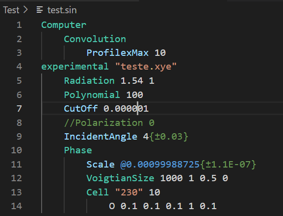
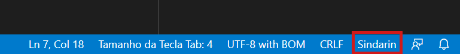
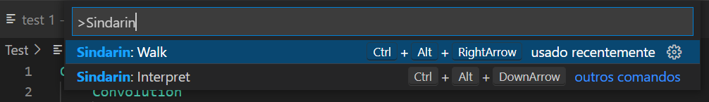
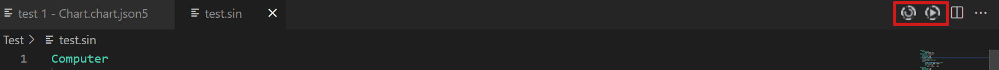
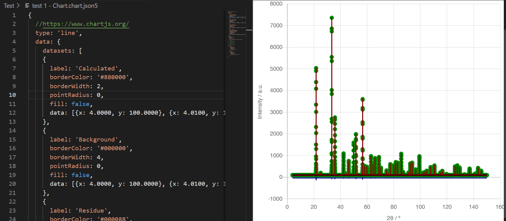

# sindarin-for-vscode

[Sindarin for VS Code](https://github.com/chartjs/Chart.js) for [VSCcode](https://code.visualstudio.com/)

Sindarin for Visual Studio Code is an extension that includes some features to make the Sindarin program easier to use with this powerful text editor.

Sindarin is a crystal diffraction calculation program that uses a dedicated script, which is simple, flexible and enables a range of possibilities for modeling theoretical diffraction patterns. 

**This extension is still a beta version**

## Features

The extension enables Sindarin code highlighting. Sindarin "language" is automatically enabled by the extension when the file with the ".sin" extension is opened in the editor or it can be enabled manually by selecting the "language mode selector" in the status bar. 

2 commands are enable:
* Interpet: run sindarin to interpret for the current sindarin file (Shortcut: Ctrl+Alt+Down Arrow)
* Walk: run sindarin to interpret and run optimization routine for the current sindarin file (Shortcut: Ctrl+Alt+Right Arrow)

These commands can be acessed by Command Pallete, short cut or two dedicated icons in editor title. 

These commands are automatically enabled with the Sindarin language signed text

Also, the [Chart.js Preview](https://github.com/chartjs/Chart.js) extension is installed together with the sindarin extension. You can view in VS Code the diffractograms of the .chart.json5 file generated after the sindarin commands

## Requirements

It is necessary to download the Sindarin program from the website:.
the program needs to be in the default folder on your computer:
* Windows: c:\Sindarin
* Linux and macOS: ~/Sindarin

If you want another folder, you need to include the path of this folder in the PATH environment variable in your operating system to allow the extension to find the Sindarin program. 

**Good Work!**
